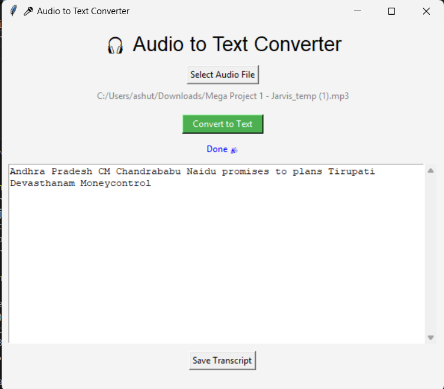

# 🎧 Audio Transcriber

A Python GUI tool that converts **any audio file** (MP3, M4A, WAV, etc.) into **text transcription** using the Google Speech Recognition API.

> 🧠 Smart enough to handle long audio (over 60 seconds) by splitting it into smaller chunks for accurate transcription.

---

## ✅ Features

- 🔊 Supports multiple formats: `.mp3`, `.m4a`, `.wav`, `.flac`, `.ogg`, etc.
- ✂️ Automatically splits long audio files into 60-second chunks
- 🧠 Uses Google Speech API to transcribe each chunk
- 💻 Beautiful and user-friendly Tkinter GUI
- 📄 Export full transcript to `.txt` file
- 🧰 Shows status updates and error messages cleanly

---

## 📂 Project Structure

audio-transcriber/
├── audio_transcriber.py # Main Python GUI and logic
├── requirements.txt # All required libraries
├── README.md # Project documentation
└── assets/
└── screenshot.png # Snapshot of the app GUI


---

## 📸 GUI Preview

Here is a snapshot of the `Audio Transcriber` in action:



> ✔️ Simple and elegant interface for selecting audio files, converting to text, and saving transcripts.

---

## 🚀 How to Set Up and Run

### 1. Clone the project

```bash
git clone https://github.com/your-username/audio-transcriber.git
cd audio-transcriber
